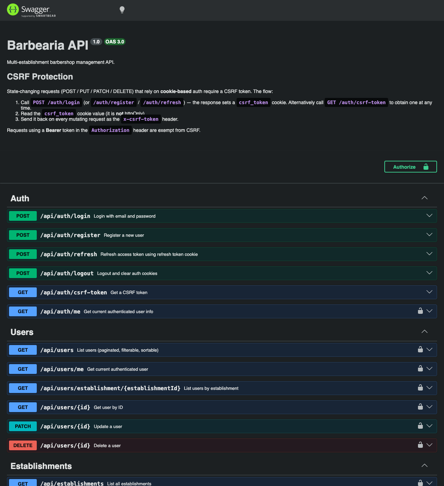

# Barbershop Management API

**English** · [Português (Brasil)](README.pt-BR.md)

[](https://github.com/FabianoArthur/barbearia-backend/actions/workflows/ci.yml)


[](LICENSE)

A REST API for barbershops that run one or more locations. Clients book online without an
account, barbers see their agenda, and managers control schedules, payments and revenue
analytics. It's built with **NestJS 11, Prisma and PostgreSQL**, with **BullMQ/Redis** for
WhatsApp reminders.

It pairs with the web frontend at
[FabianoArthur/barbearia-frontend](https://github.com/FabianoArthur/barbearia-frontend).

## Why it's interesting

- **Real scheduling rules, not CRUD.** Slot availability is computed from working hours,
  time off, per-day overrides and existing bookings. Times are timezone-aware
  (`America/Sao_Paulo` by default), and a state machine guards every status change
  (`SCHEDULED → CONFIRMED → IN_PROGRESS → DONE`, plus cancel and no-show).
- **Public booking with no login.** A client books with name and CPF, gets a short code,
  and can confirm, cancel or reschedule with it. Those endpoints have their own tight rate
  limit.
- **Personal data handled carefully.** CPF and phone are encrypted at rest with
  AES-256-GCM. CPF uses a deterministic IV so it can still be looked up. Both are masked in
  every API response.
- **Money flows.** Finishing an appointment creates a pending payment. Payments can be
  confirmed with a method and a tip, or refunded. There are also expenses and platform fees,
  and a finance dashboard (revenue, forecasts, barber and service performance, CSV/JSON
  export) whose queries are cached in Redis.
- **Background jobs.** Reminders are delayed BullMQ jobs sent 30 minutes before the slot.
  Crons handle confirmations, reminder recovery and appointment lifecycle clean-up. A
  Server-Sent Events stream pushes each barber's dashboard live.

## Architecture

<picture>
  <source media="(prefers-color-scheme: dark)" srcset="docs/assets/architecture-dark.svg">
  
</picture>

The animated dots follow one public booking, from the booking page through the request
pipeline and the `public-booking` module, into PostgreSQL and a delayed Redis job, and back
to the client as a WhatsApp reminder.

Each module under `src/modules/<name>/` follows the same DDD layering:

```
presentation/    controllers, DTOs (class-validator + Swagger), response mappers
application/     services and query handlers (use cases)
domain/          repository interfaces, state machines, pure policies (no Nest/Prisma)
infrastructure/  Prisma repositories, queues, cron jobs, external providers
```

## API docs

Interactive Swagger UI is served at **`/docs`** (the OpenAPI JSON is at `/docs-json`).



| Area | Base path | Highlights |
|---|---|---|
| Auth | `/api/auth` | login, register, refresh (rotating refresh tokens), logout, CSRF token |
| Users | `/api/users` | paginated, filterable, sortable list; soft delete |
| Establishments | `/api/establishments` | multiple locations with address, coordinates and monthly fixed cost |
| Barbers & services | `/api/barbers`, `/api/services` | commission %, which services each barber offers |
| Schedule | `/api/schedule` | working hours, time off, date overrides |
| Appointments | `/api/appointments` | create, start, finish, cancel, no-show, daily summary; live stream at `/api/sse/barber/:barberId/dashboard` |
| Public booking | `/api/public/booking` | establishments, services, barbers, availability, book / confirm / cancel / reschedule by code |
| Payments | `/api/payments` | list, confirm (method + tip), refund, refund history |
| Finance | `/api/finance` | dashboard, revenue/barber/service/customer/capacity analytics, forecast, CSV/JSON export, fee reconciliation, expenses (`/expenses`), platform fees (`/fees`) |
| Notifications | `/api/notifications` | send a WhatsApp confirmation or reminder on demand |

Roles are `BARBER`, `MANAGER` (each belongs to one establishment) and `SUPER_ADMIN`.

## Quick start

Requirements: Node 22+, Docker.

```bash
git clone https://github.com/FabianoArthur/barbearia-backend.git
cd barbearia-backend
cp .env.example .env        # then fill in JWT_SECRET, ENCRYPTION_KEY and SEED_* (commands are in the file)
npm ci
docker compose up -d        # PostgreSQL 17 + Redis 7, bound to localhost
npx prisma migrate deploy
npm run prisma:test-seed    # optional: demo data (fictional establishments, barbers, 1 year of bookings)
npm run start:dev           # http://localhost:3000/api — docs at http://localhost:3000/docs
```

To run the API itself in a container too: `docker compose --profile app up --build`.

## Configuration

Every variable is documented in [`.env.example`](.env.example). The API refuses to start
if `DATABASE_URL`, `JWT_SECRET` (32+ chars) or `ENCRYPTION_KEY` (64 hex chars) is missing
or malformed.

| Variable | Default | Notes |
|---|---|---|
| `ALLOW_PUBLIC_REGISTRATION` | open outside production, **closed** when `NODE_ENV=production` | see [Security](#security) |
| `THROTTLE_TTL_MS` / `THROTTLE_LIMIT` | `60000` / `20` | global rate limit per IP |
| `APP_TIMEZONE` | `America/Sao_Paulo` | used for working hours and slots |
| `CORS_ORIGIN` | `http://localhost:3001` | the frontend origin (credentials enabled) |
| `TWILIO_*` | unset | WhatsApp reminders; without them sends fail and are logged |

## Scripts

| Command | What it does |
|---|---|
| `npm run start:dev` | API with watch mode |
| `npm run build` / `npm run start:prod` | compile to `dist/` and run it |
| `npm run lint` / `npm run lint:fix` | Biome lint and format check |
| `npm run typecheck` | `tsc` for the app and the seed scripts |
| `npm test` / `npm run test:cov` | unit tests (with coverage) |
| `npm run test:e2e` | applies migrations to `DATABASE_URL`, then runs the HTTP suite |
| `npm run prisma:studio` | browse the database |

## Tests

- **Unit (107 tests):** pure domain logic, next to the code as `*.test.ts`. It covers
  appointment and payment state machines, slot arithmetic and timezone conversion,
  reminder timing policy, CPF validation, masking, AES-GCM encryption (including tamper
  detection), env validation, the registration policy, tenant scoping and the error filter.
- **End-to-end (81 tests):** `test/*.e2e-spec.ts` boots the real app (same pipeline as
  `main.ts`) against PostgreSQL and Redis. It covers auth and cookies, role checks, the
  booking flow, slot conflicts, availability, the status machine over HTTP, payments,
  expenses, the finance dashboard, cross-establishment access, rate limiting and security
  headers. It reaches about
  **68% of statements** in `src/`.

To run the e2e suite against a throwaway database:

```bash
export DATABASE_URL="postgresql://<user>:<password>@localhost:5432/barbearia_test?schema=public"
npm run test:e2e
```

CI (GitHub Actions) runs lint, typecheck, unit tests with coverage, build, the e2e suite
against Postgres and Redis containers, a Docker image build and a full-history
[gitleaks](https://github.com/gitleaks/gitleaks) scan on every push and pull request.

## Security

- Access and refresh tokens live in `httpOnly`, `SameSite=Lax` cookies (`Secure` in
  production). Cookie-authenticated writes need a CSRF double-submit token.
- There are no default secrets: the app fails fast on a missing or weak `JWT_SECRET`, and
  JWTs are pinned to HS256.
- Helmet headers, strict DTO whitelisting, a global rate limit plus tighter limits on
  public endpoints, and masked PII in responses and logs.
- **Known limitation:** `POST /auth/register` accepts any role, because the frontend
  creates staff accounts through it. It is closed by default in production. Only set
  `ALLOW_PUBLIC_REGISTRATION=true` on a deployment you control.

To report a vulnerability, see [SECURITY.md](SECURITY.md).

## Project structure

```
src/
  app.module.ts, app.setup.ts, main.ts   bootstrap and the shared HTTP pipeline
  config/                                 env validation and rate-limit config
  common/                                 guards (roles, CSRF), filters, validators, crypto, time utils
  infrastructure/                         Prisma and cache modules
  modules/<feature>/                      presentation / application / domain / infrastructure
prisma/                                   schema, 16 migrations, seed scripts
test/                                     e2e suite
docs/                                     product notes (PRD, context, task log) and README assets
```

## License

[MIT](LICENSE) © 2026 Fabiano Arthur
