# API de Gestão de Barbearias

[English](README.md) · **Português (Brasil)**

[](https://github.com/FabianoArthur/barbearia-backend/actions/workflows/ci.yml)


[](LICENSE)

API REST para barbearias com uma ou mais unidades. O cliente agenda online sem criar conta,
o barbeiro acompanha a agenda e o gerente controla horários, pagamentos e indicadores
financeiros. Feita com **NestJS 11, Prisma e PostgreSQL**, com **BullMQ/Redis** para os
lembretes por WhatsApp.

Funciona junto com o frontend web em
[FabianoArthur/barbearia-frontend](https://github.com/FabianoArthur/barbearia-frontend).

## O que tem de interessante

- **Regra de agenda de verdade, não só CRUD.** A disponibilidade de horários é calculada a
  partir do expediente, das folgas, das exceções por data e dos agendamentos existentes. Os
  horários levam o fuso em conta (`America/Sao_Paulo` por padrão), e uma máquina de estados
  protege cada mudança de status (`SCHEDULED → CONFIRMED → IN_PROGRESS → DONE`, além de
  cancelamento e não comparecimento).
- **Agendamento público sem login.** O cliente agenda com nome e CPF, recebe um código curto
  e usa esse código para confirmar, cancelar ou remarcar. Esses endpoints têm um limite de
  requisições próprio, mais apertado.
- **Dado pessoal tratado com cuidado.** CPF e telefone ficam cifrados no banco com
  AES-256-GCM. O CPF usa IV determinístico para continuar pesquisável. Os dois saem
  mascarados em todas as respostas da API.
- **Fluxo de dinheiro.** Finalizar um atendimento gera um pagamento pendente. O pagamento é
  confirmado com forma de pagamento e gorjeta, ou estornado. Há também despesas, taxas de
  plataforma e um painel financeiro (receita, previsão, desempenho por barbeiro e serviço,
  exportação CSV/JSON) com as consultas em cache no Redis.
- **Jobs em segundo plano.** Os lembretes são jobs atrasados do BullMQ, disparados 30 minutos
  antes do horário. Crons cuidam das confirmações, da recuperação de lembretes e da limpeza
  do ciclo de vida dos agendamentos. Um stream Server-Sent Events atualiza o painel de cada
  barbeiro ao vivo.

## Arquitetura

<picture>
  <source media="(prefers-color-scheme: dark)" srcset="docs/assets/architecture.pt-BR-dark.svg">
  
</picture>

Os pontos animados seguem um agendamento público: saem da página de agendamento, passam
pelo pipeline da requisição e pelo módulo `public-booking`, vão para o PostgreSQL e para um
job atrasado no Redis, e voltam ao cliente como lembrete no WhatsApp.

Cada módulo em `src/modules/<nome>/` segue as mesmas camadas de DDD:

```
presentation/    controllers, DTOs (class-validator + Swagger), mappers de resposta
application/     services e query handlers (casos de uso)
domain/          interfaces de repositório, máquinas de estado, políticas puras (sem Nest/Prisma)
infrastructure/  repositórios Prisma, filas, crons, provedores externos
```

## Documentação da API

O Swagger UI interativo fica em **`/docs`** (o JSON do OpenAPI em `/docs-json`).


| Área | Caminho base | Destaques |
|---|---|---|
| Auth | `/api/auth` | login, cadastro, refresh (refresh token rotativo), logout, token CSRF |
| Usuários | `/api/users` | lista paginada, com filtro e ordenação; exclusão lógica |
| Estabelecimentos | `/api/establishments` | várias unidades com endereço, coordenadas e custo fixo mensal |
| Barbeiros e serviços | `/api/barbers`, `/api/services` | % de comissão, quais serviços cada barbeiro faz |
| Agenda | `/api/schedule` | expediente, folgas, exceções por data |
| Agendamentos | `/api/appointments` | criar, iniciar, finalizar, cancelar, não comparecimento, resumo do dia; stream ao vivo em `/api/sse/barber/:barberId/dashboard` |
| Agendamento público | `/api/public/booking` | estabelecimentos, serviços, barbeiros, disponibilidade, agendar / confirmar / cancelar / remarcar pelo código |
| Pagamentos | `/api/payments` | listar, confirmar (forma + gorjeta), estornar, histórico de estornos |
| Financeiro | `/api/finance` | painel, análises de receita/barbeiro/serviço/cliente/capacidade, previsão, exportação CSV/JSON, conciliação de taxas, despesas (`/expenses`), taxas de plataforma (`/fees`) |
| Notificações | `/api/notifications` | enviar confirmação ou lembrete por WhatsApp sob demanda |

Os papéis são `BARBER`, `MANAGER` (cada um vinculado a um estabelecimento) e `SUPER_ADMIN`.

## Como rodar

Requisitos: Node 22+ e Docker.

```bash
git clone https://github.com/FabianoArthur/barbearia-backend.git
cd barbearia-backend
cp .env.example .env        # preencha JWT_SECRET, ENCRYPTION_KEY e SEED_* (os comandos estão no arquivo)
npm ci
docker compose up -d        # PostgreSQL 17 + Redis 7, só em localhost
npx prisma migrate deploy
npm run prisma:test-seed    # opcional: dados de demonstração (barbearias, barbeiros e 1 ano de agendamentos, todos fictícios)
npm run start:dev           # http://localhost:3000/api (docs em http://localhost:3000/docs)
```

Para rodar a API também em container: `docker compose --profile app up --build`.

## Configuração

Todas as variáveis estão documentadas no [`.env.example`](.env.example). A API não sobe se
`DATABASE_URL`, `JWT_SECRET` (32+ caracteres) ou `ENCRYPTION_KEY` (64 caracteres hex)
estiverem ausentes ou inválidas.

| Variável | Padrão | Observação |
|---|---|---|
| `ALLOW_PUBLIC_REGISTRATION` | aberto fora de produção, **fechado** com `NODE_ENV=production` | veja [Segurança](#segurança) |
| `THROTTLE_TTL_MS` / `THROTTLE_LIMIT` | `60000` / `20` | limite global de requisições por IP |
| `APP_TIMEZONE` | `America/Sao_Paulo` | fuso do expediente e dos horários |
| `CORS_ORIGIN` | `http://localhost:3001` | origem do frontend (com credenciais) |
| `TWILIO_*` | vazio | lembretes por WhatsApp; sem as credenciais, o envio falha e é registrado no log |

## Scripts

| Comando | O que faz |
|---|---|
| `npm run start:dev` | API em modo watch |
| `npm run build` / `npm run start:prod` | compila para `dist/` e roda |
| `npm run lint` / `npm run lint:fix` | lint e formatação com Biome |
| `npm run typecheck` | `tsc` da aplicação e dos seeds |
| `npm test` / `npm run test:cov` | testes unitários (com cobertura) |
| `npm run test:e2e` | aplica as migrations no `DATABASE_URL` e roda a suíte HTTP |
| `npm run prisma:studio` | navega pelo banco |

## Testes

- **Unitários (107 testes):** lógica de domínio pura, ao lado do código como `*.test.ts`.
  Cobrem as máquinas de estado de agendamento e pagamento, a aritmética de horários e a
  conversão de fuso, a política de horário do lembrete, a validação de CPF, o mascaramento,
  a cifra AES-GCM (inclusive a detecção de adulteração), a validação do ambiente, a política
  de cadastro, o escopo por estabelecimento e o filtro de erros.
- **Ponta a ponta (81 testes):** `test/*.e2e-spec.ts` sobe a aplicação real (o mesmo
  pipeline do `main.ts`) contra PostgreSQL e Redis. Cobrem auth e cookies, checagem de
  papéis, o fluxo de agendamento, conflito de horários, disponibilidade, a máquina de estados
  via HTTP, pagamentos, despesas, o painel financeiro, acesso entre estabelecimentos, limite
  de requisições e cabeçalhos de segurança. Atingem cerca de **68% das instruções** de `src/`.

Para rodar a suíte e2e num banco descartável:

```bash
export DATABASE_URL="postgresql://<usuario>:<senha>@localhost:5432/barbearia_test?schema=public"
npm run test:e2e
```

A CI (GitHub Actions) roda em todo push e pull request: lint, typecheck, testes unitários
com cobertura, build, a suíte e2e contra containers de Postgres e Redis, o build da imagem
Docker e uma varredura do [gitleaks](https://github.com/gitleaks/gitleaks) no histórico
inteiro.

## Segurança

- Os tokens de acesso e de refresh ficam em cookies `httpOnly` com `SameSite=Lax`
  (`Secure` em produção). Escritas autenticadas por cookie exigem um token CSRF
  (double submit).
- Não existe segredo padrão: a aplicação não sobe com `JWT_SECRET` ausente ou fraco, e os
  JWTs ficam presos ao HS256.
- Cabeçalhos do helmet, whitelist estrita nos DTOs, limite global de requisições mais
  limites apertados nos endpoints públicos, e dados pessoais mascarados nas respostas e nos
  logs.
- **Limitação conhecida:** o `POST /auth/register` aceita qualquer papel, porque o frontend
  cria as contas da equipe por ele. Ele vem fechado por padrão em produção. Só use
  `ALLOW_PUBLIC_REGISTRATION=true` num ambiente que você controla.

Para reportar uma vulnerabilidade, veja o [SECURITY.md](SECURITY.md).

## Estrutura

```
src/
  app.module.ts, app.setup.ts, main.ts   bootstrap e o pipeline HTTP compartilhado
  config/                                 validação do ambiente e limite de requisições
  common/                                 guards (papéis, CSRF), filtros, validadores, cifra, utilitários de horário
  infrastructure/                         módulos do Prisma e do cache
  modules/<feature>/                      presentation / application / domain / infrastructure
prisma/                                   schema, 16 migrations, scripts de seed
test/                                     suíte e2e
docs/                                     notas de produto (PRD, contexto, log de tarefas) e imagens do README
```

## Licença

[MIT](LICENSE) © 2026 Fabiano Arthur
